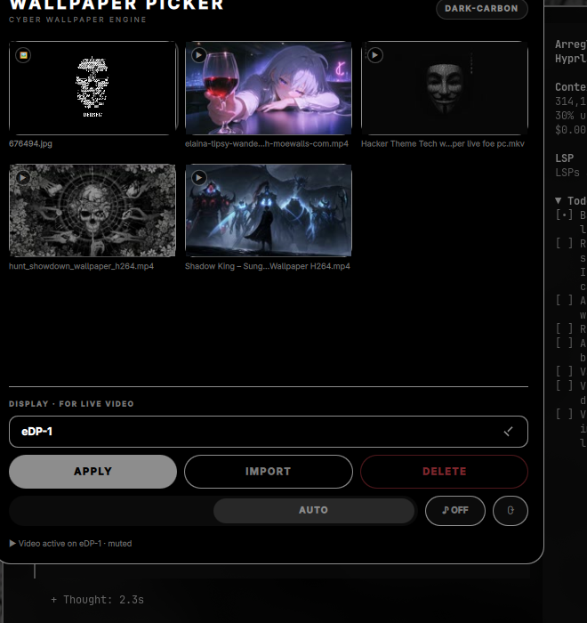

# Wallpaper Picker

Plugin de [Omarchy](https://omarchy.org/) para navegar, aplicar, importar y eliminar fondos de pantalla — imágenes **y vídeos vivos** — del tema activo, sin salir del escritorio.



## Características

- ✅ **Grid masonry** con las miniaturas de los fondos del tema activo, cada una a su proporción real.
- ✅ **Vídeos vivos** con `mpvpaper`: loop, con o sin sonido, y **miniatura autogenerada** (fotograma extraído con `ffmpeg` y cacheado).
- ✅ **Un vídeo por monitor**: puedes tener fondos distintos en cada pantalla y aplicar en uno **no toca** los demás.
- ✅ **Pausa automática**: si una ventana tapa casi todo un monitor, el vídeo se pausa solo y vuelve al despejarse.
- ✅ **Persistencia**: el fondo aplicado sobrevive a reinicios y cambios de workspace.
- ✅ **Importa** fondos con `zenity` y **elimina** los tuyos moviéndolos a la papelera.
- ✅ Se integra con el sistema: si cambias el fondo por el switcher de Omarchy, el plugin se aparta.
- ✅ Se **adapta al tema activo**: colores, acentos y bordes se re-tematizan en vivo.
- ✅ Panel **arrastrable** que recuerda su posición.

## Requisitos

| Paquete | ¿Necesario? | Para qué |
|---|---|---|
| Omarchy + Hyprland + Quickshell | **Sí** | El shell donde vive el plugin |
| `mpvpaper` | Solo para vídeos | Reproducir `.mkv`/`.mp4` como fondo |
| `ffmpeg` | Solo para vídeos | Generar las miniaturas (viene con `mpv`) |
| `socat` | Recomendado | Pausar el vídeo por IPC |

Las imágenes **funcionan sin instalar nada extra**.

## Instalación

### Omarchy CLI (recomendado)

```bash
omarchy plugin add https://github.com/madmasx/madmasx.wallpaper-picker --enable
omarchy restart shell
```

### Manual

```bash
git clone https://github.com/madmasx/madmasx.wallpaper-picker
cd madmasx.wallpaper-picker
./install.sh
```

`install.sh` instala `mpvpaper` si falta, copia el plugin a `~/.config/omarchy/plugins/`, lo habilita y recarga el shell.

## Uso

Abre el panel con el **botón de la barra** o desde la terminal:

```bash
omarchy shell madmasx.wallpaper-picker toggle    # abrir/cerrar
omarchy shell madmasx.wallpaper-picker open      # abrir
omarchy shell madmasx.wallpaper-picker close     # cerrar
omarchy shell madmasx.wallpaper-picker sound     # sonido del vídeo
omarchy shell madmasx.wallpaper-picker mute      # silenciar
omarchy shell madmasx.wallpaper-picker autopause  # alternar pausa automática
omarchy shell madmasx.wallpaper-picker scan      # forzar reescaneo
```

Dentro del panel:

- **Clic en una miniatura** → la selecciona.
- **APPLY** → aplica la imagen o lanza el vídeo en el monitor elegido.
- **IMPORT** → elige un archivo con `zenity`; se instala en la carpeta del tema actual.
- **DELETE** → confirma y mueve a la papelera el fondo seleccionado (solo los del tema del usuario).
- **AUTO / OFF** → activa o desactiva la pausa automática cuando una ventana tapa el monitor.
- **♪ ON/OFF** → sonido del vídeo (silenciado por defecto).
- **⟳** → reescanea las carpetas de fondos.
- **Escape** o clic fuera → cierra. **Arrastrar la cabecera** → mueve el panel.

### Atajo de teclado (opcional)

El plugin no modifica `bindings.lua` por ti, así que el atajo es opcional y lo registras tú si lo quieres. Añade esta línea a `~/.config/hypr/bindings.lua`:

```lua
bind = SUPER + ALT, W, omarchy shell madmasx.wallpaper-picker toggle, Wallpaper picker
```

Recarga Hyprland con `hyprctl reload` o cierra sesión.

## Dónde busca los fondos

El plugin lee las mismas rutas que usa Omarchy, así que lo que ves en el switcher aparece en el panel:

1. `~/.config/omarchy/backgrounds/<tema>/` — tus fondos por tema.
2. `~/.local/state/omarchy/current/theme/backgrounds/` — los del tema aplicado.
3. `/usr/share/omarchy/themes/<tema>/backgrounds/` — los de sistema.

Se deduplican por nombre y se ignoran las descargas incompletas (`.part`, `.crdownload`).

## Cómo funciona

- **Imágenes**: se enlazan con `omarchy-theme-bg-set`, así que persisten y viajan con el tema en git.
- **Vídeos**: `mpvpaper -f -o [no-audio ]loop <monitor> <archivo>`, uno por monitor. El estado (monitor, archivo, sonido y el fondo base) se guarda en `~/.local/state/omarchy/plugins/madmasx.wallpaper-picker/video` y se relanza al iniciar sesión.
- **GPUs híbridas**: en equipos con NVIDIA **e** Intel/AMD fuerza el EGL de Mesa (`__EGL_VENDOR_LIBRARY_FILENAMES=50_mesa.json`) para evitar los crashes del driver NVIDIA al renderizar sobre una superficie ajena. En equipos de una sola GPU no cambia nada.
- **Pausa por ventanas**: manda `set pause` por el socket IPC de `mpvpaper`, **sin matar el proceso** (volver es instantáneo). Cada 1,5 s mide si las ventanas del workspace visible tapan ≥90% del área de trabajo; usa la **unión** de los rectángulos, así que dos ventanas lado a lado cuentan como cobertura sin contar dos veces lo que se solapa. Medido: **~63% de un core reproduciendo → ~0% pausado**.
- **Integración con Omarchy**: si con vídeos activos cambias el fondo por el switcher o cambias de tema, el plugin lo detecta (vigila el symlink `current/background`) y detiene los vídeos para no tapar el fondo nuevo.

## Permisos y alcance

Para que se pueda revisar sin instalar nada, esto es **exactamente** lo que hace el plugin y su instalador.

### Usa `sudo` solo para esto

```bash
sudo pacman -S --needed --noconfirm mpvpaper socat
```

Se ejecuta **únicamente** desde `install.sh`, **solo si falta** `mpvpaper` o `socat`, y con `--needed` (no actualiza ni reinstala lo que ya está). Si no hay `pacman`, no hace nada y avisa. Si instalas con `omarchy plugin add`, **no se pide sudo en ningún momento** y las imágenes funcionan igual.

### Rutas que escribe

| Ruta | Para qué |
|---|---|
| `~/.config/omarchy/plugins/madmasx.wallpaper-picker/` | El propio plugin (Omarchy lo gestiona) |
| `~/.local/state/omarchy/plugins/madmasx.wallpaper-picker/video` | Estado de los vídeos por monitor |
| `~/.local/state/omarchy/plugins/madmasx.wallpaper-picker/ipc/` | Sockets IPC de mpv para la pausa |
| `~/.local/state/omarchy/plugins/madmasx.wallpaper-picker/thumbs/` | Miniaturas de vídeo generadas con ffmpeg |
| `~/.local/state/omarchy/plugins/madmasx.wallpaper-picker/{pos,autopause}` | Posición del panel y preferencia de pausa |
| `~/.local/share/Trash/` | Solo si usas DELETE (envía a la papelera, no borra) |

### Comandos que invoca

`omarchy-theme-bg-set`, `omarchy plugin enable`, `omarchy restart shell`, `mpvpaper`, `pkill`, `hyprctl`, `ffmpeg`, `gio trash`, `socat`.

### Lo que nunca hace

- No escribe en tu tema, ni en configs de terminal (alacritty/ghostty/kitty), ni en Hyprland, ni en `bindings.lua`.
- No borra directorios completos: `install.sh` reemplaza solo los archivos que pertenecen al plugin y pide confirmación antes.
- No lee ni escribe fuera de tu `$HOME` (salvo el `sudo pacman` de arriba).
- No envía nada a ningún servidor: no hay telemetría ni red más allá de descargar el repo al instalarlo.

## Desinstalar

```bash
omarchy plugin remove madmasx.wallpaper-picker --yes
rm -rf ~/.config/omarchy/plugins/madmasx.wallpaper-picker
omarchy restart shell
```

## Notas

- El plugin no toca la configuración del tema, terminales ni Hyprland: solo gestiona el fondo de pantalla.
- Las imágenes no requieren `mpvpaper`; si no está instalado, los vídeos simplemente no funcionan.

## Licencia

MIT — ver [LICENSE](LICENSE).

Hecho con 🖤 por [madmasx](https://github.com/madmasx).
